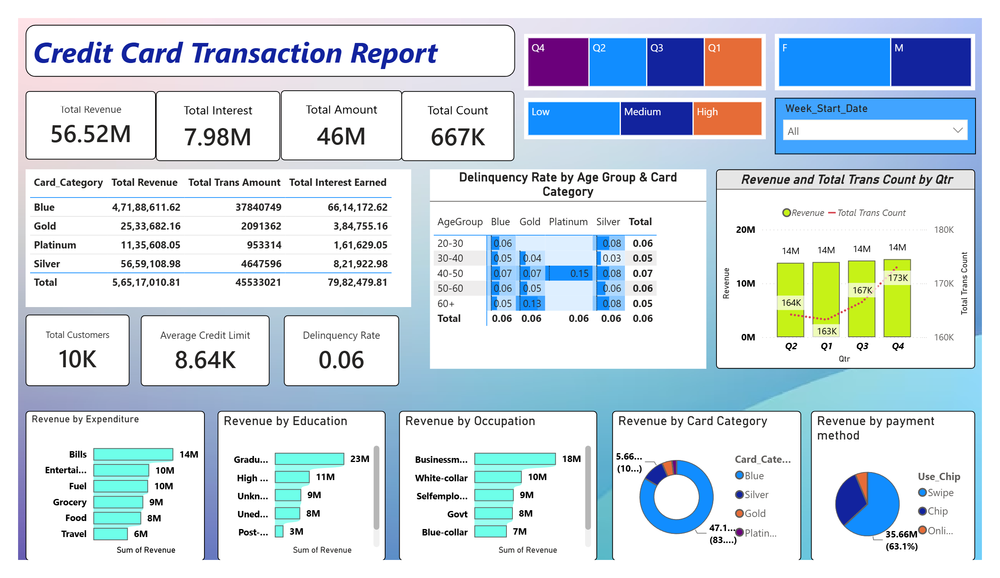
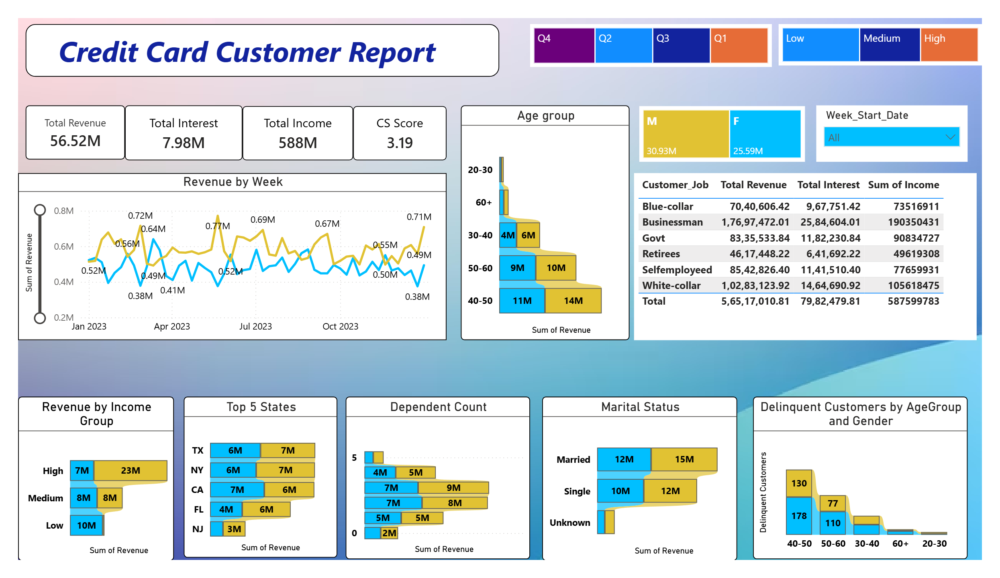

````markdown
# 💳 Credit Card Financial Dashboard

## 📊 Data Analytics Project | SQL Server + Power BI

An end-to-end data analytics project that analyzes credit card transactions and customer information to uncover insights into revenue, customer behavior, transaction trends, card performance, and delinquency risk.

---

## 📌 Project Overview

The objective of this project is to transform raw credit card and customer data into an interactive Power BI dashboard that helps identify key business trends and customer segments.

The project covers:

- Revenue and transaction analysis
- Credit card category performance
- Customer segmentation
- Spending behavior
- Payment method analysis
- Customer demographics
- Delinquency and risk analysis
- Business recommendations

---

## 🛠️ Tools & Technologies

| Tool | Purpose |
|---|---|
| **SQL Server** | Database creation, data preparation and analysis |
| **Power BI** | Interactive dashboard and visualization |
| **DAX** | KPI and analytical measures |
| **Power Query** | Data transformation |
| **Excel / CSV** | Source data |

---

## 🗂️ Dataset

The project uses two main datasets:

### Customer Data

Contains customer demographic and behavioral information such as:

- Customer Age
- Gender
- Education
- Marital Status
- State
- Customer Job
- Income
- Dependents
- Customer Satisfaction Score

### Credit Card Data

Contains credit card and transaction information such as:

- Card Category
- Credit Limit
- Annual Fees
- Transaction Amount
- Transaction Count
- Interest Earned
- Credit Utilization
- Payment Method
- Expenditure Type
- Delinquency Status

The datasets are available in the [`datasets`](./datasets) folder.

---

## 🔗 Data Model

The two tables are connected using the customer identifier:

```text
cust_detail[Client_Num]
        │
        │  1 : *
        ▼
cc_details[Client_Num]
````

This relationship allows customer-level information to be analyzed together with credit card transactions.

---

# 📊 Dashboard

The Power BI report consists of two main analytical views:

## 1. Credit Card Transaction Report

This dashboard focuses on overall credit card performance.

### Key KPIs

* Total Revenue: **56.52M**
* Total Interest: **7.98M**
* Total Transaction Amount: **46M**
* Total Transactions: **667K**
* Total Customers: **10K**
* Average Credit Limit: **8.64K**

### Analysis Includes

* Revenue by Card Category
* Revenue by Payment Method
* Revenue by Expenditure Type
* Revenue by Education
* Revenue by Occupation
* Quarterly Revenue & Transaction Trends

---

## 2. Credit Card Customer Report

This dashboard focuses on customer demographics and behavior.

### Analysis Includes

* Revenue by Age Group
* Revenue by Income Group
* Top 5 States
* Revenue by Customer Job
* Dependent Count
* Marital Status
* Revenue by Gender
* Weekly Revenue Trends

---

# ⚠️ Credit Card Risk Analysis

A key part of the project is analyzing customer delinquency.

Yes. Since these are part of the actual Power BI work, they should be included in the **DAX Measures & Calculated Columns** section of your README. I'd update that section professionally like this:

````markdown
# 📐 DAX Calculations

The project uses DAX to create calculated columns and measures for customer segmentation, revenue analysis, and delinquency analysis.

## 1. Age Group

A calculated column was created to segment customers based on age:

```DAX
AgeGroup =
SWITCH(
    TRUE(),
    cust_detail[Customer_Age] < 30, "20-30",
    cust_detail[Customer_Age] >= 30 &&
        cust_detail[Customer_Age] < 40, "30-40",
    cust_detail[Customer_Age] >= 40 &&
        cust_detail[Customer_Age] < 50, "40-50",
    cust_detail[Customer_Age] >= 50 &&
        cust_detail[Customer_Age] < 60, "50-60",
    cust_detail[Customer_Age] >= 60, "60+",
    "Unknown"
)
````

### Age Groups

* 20–30
* 30–40
* 40–50
* 50–60
* 60+

---

## 2. Income Group

Customers were segmented into income groups to compare revenue and customer behavior across different income levels.

```DAX
Income Group =
SWITCH(
    TRUE(),
    cust_detail[Income] < 35000, "Low",
    cust_detail[Income] >= 35000 &&
        cust_detail[Income] < 70000, "Medium",
    cust_detail[Income] >= 70000, "High",
    "Unknown"
)
```

### Income Segments

* **Low:** < 35,000
* **Medium:** 35,000–69,999
* **High:** ≥ 70,000

---

## 3. Revenue

A calculated revenue column was created by combining annual fees, transaction amount, and interest earned:

```DAX
Revenue =
    cc_details[Annual_Fees]
    + cc_details[Total_Trans_Amt]
    + cc_details[Interest_Earned]
```

This metric is used to analyze revenue across:

* Card Category
* Age Group
* Income Group
* Customer Job
* Education
* Expenditure Type
* Payment Method
* State
* Quarterly trends

---

## 4. Delinquent Customers

```DAX
Delinquent Customers =
CALCULATE(
    DISTINCTCOUNT(cc_details[Client_Num]),
    cc_details[Delinquent_Acc] = "1"
)
```

---

## 5. Total Customers

```DAX
Total Customers =
DISTINCTCOUNT(cc_details[Client_Num])
```

---

## 6. Delinquency Rate

```DAX
Delinquency Rate =
DIVIDE(
    [Delinquent Customers],
    [Total Customers],
    0
)
```

The delinquency rate was used to identify potentially higher-risk customer segments by **Age Group** and **Card Category**.

```

### One important distinction for your README

Your first three are **calculated columns**, while the last three are **measures**.

| DAX | Type | Purpose |
|---|---|---|
| `AgeGroup` | Calculated Column | Customer age segmentation |
| `Income Group` | Calculated Column | Income segmentation |
| `Revenue` | Calculated Column | Row-level revenue calculation |
| `Delinquent Customers` | Measure | Count of delinquent customers |
| `Total Customers` | Measure | Unique customer count |
| `Delinquency Rate` | Measure | Overall/segment delinquency rate |

This distinction makes the README look more technically accurate and professional.
```

# 🔍 Key Business Insights

### 💳 1. Card Category Performance

Blue card customers contribute approximately **83% of total revenue**, making Blue the dominant revenue-generating card category.

### 📅 2. Quarterly Performance

**Q4 recorded the highest revenue and transaction volume**, indicating stronger customer spending activity toward the end of the year.

### 💰 3. Expenditure Behavior

**Bills** represent the highest-revenue expenditure category, followed by Entertainment and Fuel.

### 👔 4. Customer Segmentation

**Business customers** are among the highest revenue-generating occupational segments, making them an important target for retention and personalized offers.

### ⚠️ 5. Delinquency Risk

The overall delinquency rate is approximately **6%**.

The **40–50 age group with Platinum cards recorded a 15% delinquency rate**, identifying a potentially higher-risk customer segment.

The **60+ age group with Gold cards recorded a 13% delinquency rate**, representing another segment that may require closer monitoring.

### 💳 6. Payment Method

**Swipe transactions generate the highest revenue**, while online transactions contribute a comparatively smaller share, indicating an opportunity to increase digital payment adoption.

### ⭐ 7. Customer Satisfaction

The average customer satisfaction score is approximately **3.19/5**, indicating moderate satisfaction and potential opportunities to improve customer experience.

---

# 💡 Business Recommendations

Based on the analysis:

1. **Strengthen retention strategies** for Blue card customers due to their significant contribution to revenue.

2. **Target high-value customer segments**, particularly business customers and customers aged 40–50.

3. **Monitor high-risk segments**, especially 40–50-year-old Platinum card customers and 60+ Gold card customers.

4. **Encourage digital payment adoption** through online transaction rewards and targeted promotions.

5. **Leverage Q4 spending trends** by introducing seasonal campaigns during high-activity periods.

6. **Analyze customer satisfaction drivers** to identify areas for improving customer experience.

---

# 📁 Project Structure

```text
Credit_card_Financial_Dashboard/
│
├── 📂 datasets/
│   ├── cc_add.csv
│   ├── credit_card.csv
│   ├── cust_add.csv
│   └── customer.csv
│
├── 📄 Credit Card Report.pbix
├── 📄 Credit Card Customer Report.pdf
├── 📄 Credit Card Transaction Report.pdf
├── 📄 Financial Dashboard Data.sql
├── 📄 Weekly Insight Report.docx
└── 📄 README.md
```

---

# 🔄 Project Workflow

```text
Raw Data
   ↓
Data Understanding
   ↓
SQL Server
   ↓
Data Cleaning & Preparation
   ↓
Data Modeling
   ↓
Power BI
   ↓
DAX Measures
   ↓
Interactive Dashboard
   ↓
Business Insights
   ↓
Recommendations
```

---

# 🎯 Skills Demonstrated

* SQL
* Power BI
* DAX
* Power Query
* Data Cleaning
* Data Modeling
* Data Visualization
* KPI Development
* Customer Segmentation
* Risk Analysis
* Business Intelligence
* Business Insight Generation

---

# 📸 Dashboard Preview

### Credit Card Transaction Report



### Credit Card Customer Report


> Dashboard screenshots can be added to the repository for a visual preview.

---

# 👨‍💻 Author

**Vikas Rajbhar**

B.Sc. Computer Science Graduate | Aspiring Data Analyst

**Core Skills:**
`SQL` `Power BI` `DAX` `Excel` `Python` `Pandas` `Data Analytics`

---

## ⭐ Project Highlights

This project demonstrates an end-to-end approach to data analytics — from **raw data and SQL analysis to Power BI visualization and actionable business recommendations**.


